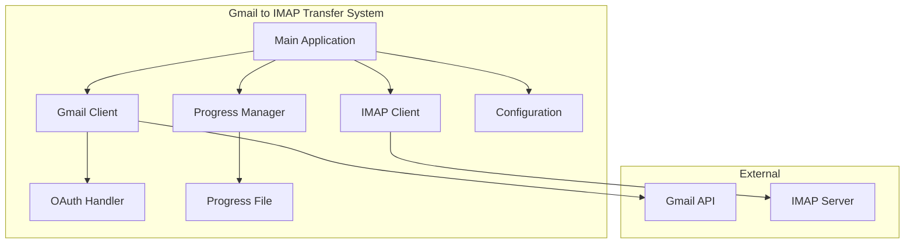
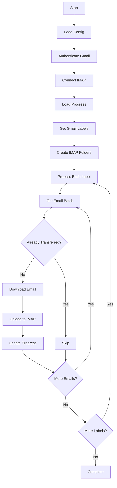

# Gmail to IMAP Transfer System - Technical Specification

## Overview

A simplified Python-based system that transfers emails from Gmail to any IMAP server while preserving folder structure, metadata, and content. The system supports progress tracking and resumable transfers.

## System Architecture



## Core Components

### 1. Main Application (`gmail_to_imap.py`)
**Single entry point that orchestrates the entire transfer**
- Loads configuration
- Handles authentication
- Manages the transfer process
- Provides progress updates

### 2. Gmail Client
**Handles Gmail API interactions**
- OAuth 2.0 authentication
- Fetch emails and labels
- Handle API rate limits

### 3. IMAP Client
**Manages IMAP server operations**
- Connect to target server
- Create folders
- Upload emails with metadata

### 4. Progress Manager
**Simple progress tracking**
- JSON file to track completed transfers
- Resume from last checkpoint
- Basic duplicate detection

### 5. Configuration
**Simple YAML/JSON configuration**
- Gmail OAuth credentials
- IMAP connection details
- Transfer settings

## Data Flow



## Required Libraries

```python
# Core dependencies
google-auth-oauthlib==1.0.0
google-api-python-client==2.100.0
imapclient==2.3.1
pyyaml==6.0.1
tqdm==4.66.1  # Progress bar
```

## Project Structure

```
gmail_to_imap/
├── gmail_to_imap.py          # Main application
├── config.yaml               # Configuration file
├── credentials.json          # OAuth credentials
├── progress.json            # Progress tracking
├── requirements.txt         # Dependencies
└── README.md               # Usage instructions
```

## Configuration Format

### config.yaml
```yaml
gmail:
  credentials_file: "credentials.json"
  
imap:
  server: "imap.example.com"
  port: 993
  username: "user@example.com"
  password: "your-password"
  use_ssl: true

settings:
  batch_size: 50
  max_retries: 3
  resume_from_progress: true
```

## Progress Tracking Format

### progress.json
```json
{
  "session_id": "2024-01-15_12-30-45",
  "total_labels": 5,
  "completed_labels": 2,
  "current_label": "INBOX",
  "transferred_messages": {
    "INBOX": ["msg_id_1", "msg_id_2", "..."],
    "SENT": ["msg_id_3", "msg_id_4", "..."]
  },
  "label_folder_mapping": {
    "INBOX": "INBOX",
    "SENT": "Sent",
    "DRAFT": "Drafts"
  }
}
```

## Core Transfer Logic

```python
class GmailToImapTransfer:
    def __init__(self):
        self.config = self.load_config()
        self.progress = self.load_progress()
        self.gmail_client = None
        self.imap_client = None
    
    def run(self):
        # 1. Setup connections
        self.setup_gmail()
        self.setup_imap()
        
        # 2. Get labels and create folders
        labels = self.get_gmail_labels()
        self.create_imap_folders(labels)
        
        # 3. Transfer emails by label
        for label in labels:
            if self.is_label_completed(label):
                continue
            self.transfer_label(label)
        
        # 4. Complete
        self.finalize_transfer()
    
    def transfer_label(self, label):
        messages = self.get_gmail_messages(label)
        for msg_id in messages:
            if self.is_message_transferred(msg_id):
                continue
            
            # Download from Gmail
            email_data = self.download_email(msg_id)
            
            # Upload to IMAP
            self.upload_to_imap(email_data, label)
            
            # Track progress
            self.mark_message_completed(msg_id, label)
```

## Error Handling

```python
def safe_transfer(func, max_retries=3):
    """Simple retry decorator"""
    for attempt in range(max_retries):
        try:
            return func()
        except Exception as e:
            if attempt == max_retries - 1:
                raise
            time.sleep(2 ** attempt)  # Exponential backoff
```

## Key Features

### Essential Features Retained
1. **OAuth 2.0 Authentication**: Secure Gmail access
2. **Progress Tracking**: Resume interrupted transfers
3. **Folder Mapping**: Gmail labels to IMAP folders
4. **Metadata Preservation**: Basic email metadata (flags, dates)
5. **Duplicate Detection**: Skip already transferred emails
6. **Error Recovery**: Basic retry mechanism
7. **Progress Reporting**: Simple progress bar

### Simplifications Made
1. **Single Main File**: Core logic in one file instead of multiple modules
2. **JSON Progress**: Simple file-based progress instead of database
3. **Basic Error Handling**: Simple retry logic instead of complex error management
4. **Minimal Dependencies**: Only essential libraries
5. **Simple Configuration**: YAML file instead of complex config system
6. **Basic Authentication**: Standard OAuth flow without advanced token management
7. **Linear Processing**: Process one label at a time instead of parallel processing

## Implementation Phases

### Phase 1: Setup and Authentication
1. Create project structure
2. Setup OAuth 2.0 credentials
3. Implement Gmail authentication
4. Test Gmail API connection

### Phase 2: IMAP Connection
1. Implement IMAP client
2. Test IMAP server connection
3. Implement folder creation

### Phase 3: Core Transfer Logic
1. Implement email fetching from Gmail
2. Implement email upload to IMAP
3. Add metadata preservation
4. Test basic transfer functionality

### Phase 4: Progress Tracking
1. Implement progress file management
2. Add resume capability
3. Implement duplicate detection
4. Add progress reporting

### Phase 5: Error Handling and Polish
1. Add retry mechanisms
2. Implement error logging
3. Add configuration validation
4. Create documentation

## Security Considerations

1. **OAuth 2.0**: Secure authentication without storing passwords
2. **Credential Storage**: Secure storage of OAuth tokens
3. **SSL/TLS**: Encrypted connections to both Gmail and IMAP
4. **Configuration Security**: Secure handling of IMAP credentials

## Performance Considerations

1. **Batch Processing**: Process emails in configurable batches
2. **Rate Limiting**: Respect Gmail API rate limits
3. **Memory Management**: Handle large emails efficiently
4. **Progress Checkpointing**: Regular progress saves

## Testing Strategy

1. **Unit Tests**: Test individual components
2. **Integration Tests**: Test Gmail and IMAP connections
3. **End-to-End Tests**: Test complete transfer process
4. **Error Scenario Tests**: Test error handling and recovery

## Deployment Considerations

1. **Environment Setup**: Python environment and dependencies
2. **Credential Management**: Secure credential storage
3. **Monitoring**: Basic logging and progress reporting
4. **Backup**: Progress file backup strategy

This specification provides a complete blueprint for implementing the Gmail to IMAP transfer system with a focus on simplicity while maintaining essential functionality.